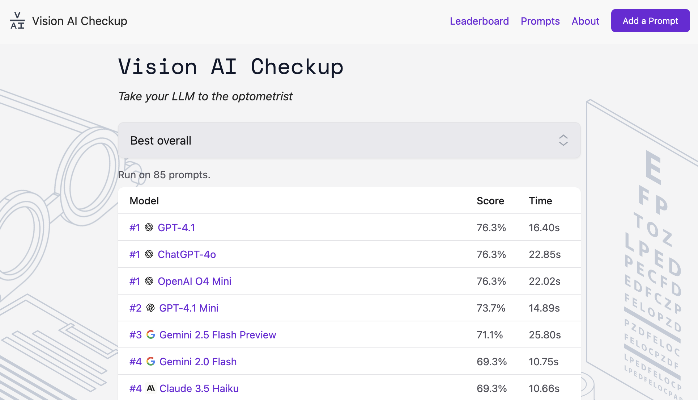

# Vision AI Checkup



[Vision AI Checkup](https://visioncheckup.com) is a tool to evaluate vision-capable language models on real-world problems.

The assessment consists of dozens of images, questions, and answers that we benchmark against models. We run the assessment every time we add a new model to the leaderboard.

You can use the vision assessment to gauge how well a model does generally, without having to understand a complex benchmark with thousands of data points.

The assessment and models are constantly evolving. This means that as more tasks get added or models receive updates, we can build a clearer picture of the current state-of-the-art models in real-time.

## Run the Assessment

To run the assessment suite, first clone this project and install the required dependencies:

```
git clone https://github.com/roboflow/vision-ai-checkup
pip install -r requirements.txt
```

You will then need API keys for all vendors used in the assessment. You can set these as follows:

```
export OPENAI_API_KEY=your-key
export HUGGINGFACE_API_KEY=your-key # used for Llama
export ANTHROPIC_API_KEY=your-key
export COHERE_API_KEY=your-key # you will need a production API key
export GEMINI_API_KEY=your-key
export TOGETHER_API_KEY=your-key
```

Then, run:

```
python3 assess.py
```

## Contributing

### Contribute an Assessment

You can contribute an assessment to add to the Vision AI assessment suite.

To contribute an assessment, first fork the project and clone it locally:

```
git clone https://github.com/<your-github-username>/vision-ai-checkup
```

Then:

1. Add the image you want to use in your assessment to the `images` folder.
2. Add an entry to the `prompts.csv` file with:
    - The file name (`file_name`).
    - The prompt to use (`prompt`).
    - The correct answer (`answer`).
    - A name for the assessment (`assessment_name`).
    - A category for the assessment. If possible, choose an existing category. If your assessment requires a new category, please note why this makes sense in your PR description.
    - Your name (`submitted_by`).
    - A URL you want to link to (`submitted_by_link`).
3. File a PR.

> [!WARNING]
> 
> Images must be no more than 2MB. This will ensure that your image is not too big to be run through supported APIs.

### Add a Model

The `models` directory contains implementations for all supported model vendors. Each model implementation inherits from the base `Model` class in `models/model.py`.

#### Adding a Model from an Existing Vendor

If you want to add a new model from a vendor that is already supported (e.g., OpenAI, Anthropic, etc.), you only need to update the `model_providers` dictionary in `assess.py`. For example:

```python
model_providers = {
    # ... existing models ...
    "Your New Model Name": OpenAIModel(model_id="your-model-id"),
    # or
    "Your New Model Name": AnthropicModel(model_id="your-model-id"),
    # etc.
}
```

#### Adding Support for a New Vendor

To add support for a new vendor/model provider:

1. Create a new file in the `models` directory (e.g., `models/your_vendor.py`).

2. Create a class that inherits from the base `Model` class:
   ```python
   from .model import Model

   class YourVendorModel(Model):
       def __init__(self, model_id: str, api_key: str = None, base_url: str = None):
           self.model_id = model_id
           self.api_key = api_key or os.environ.get("YOUR_VENDOR_API_KEY")
           self.base_url = base_url
           # Add any other initialization needed

       def run(self, image: str, prompt: str, image_name=None, structured_output_format: str = None):
           # Implement the model's inference logic here
           # - image: The image data as bytes
           # - prompt: The text prompt to send with the image
           # - image_name: Optional filename for logging
           # - structured_output_format: Optional format string for structured output
           
           # Your implementation should:
           # 1. Prepare the image and prompt for your vendor's API
           # 2. Make the API call
           # 3. Process the response
           # 4. Return the model's text response
           
           # Example:
           # response = your_vendor_api_call(image, prompt)
           # return response.text
           raise NotImplementedError("Implement your vendor's API call here")
   ```

3. Add your model to the `model_providers` dictionary in `assess.py`:
   ```python
   from models.your_vendor import YourVendorModel

   model_providers = {
       # ... existing models ...
       "Your Model Name": YourVendorModel(
           model_id="your-model-id",
           api_key=os.environ.get("YOUR_VENDOR_API_KEY"),  # Optional if using env var
           base_url="your-api-base-url"  # Optional
       ),
   }
   ```

4. Add the required API key to the environment variables section in the README and update the setup instructions if needed.

5. Test your implementation by running the assessment:
   ```bash
   python3 assess.py
   ```

#### Model Implementation Requirements

Your model implementation should:

- Handle API authentication and any required headers
- Process the image data appropriately for your vendor's API
- Handle API errors and retries (the base class provides retry logic)
- Return the model's response as a string
- Support optional structured output format if your model can handle it
- Log appropriate information for debugging

See the existing model implementations in the `models` directory for examples:
- `models/openai.py` for OpenAI models
- `models/anthropic.py` for Anthropic models
- `models/gemini.py` for Google's Gemini models
- etc.

### Bugs, other changes

If you notice any bugs or see improvements that can be made to the assessment code or website, please create an Issue so we can discuss the changes before you start work.

## License

This project is licensed under an [MIT license](LICENSE).